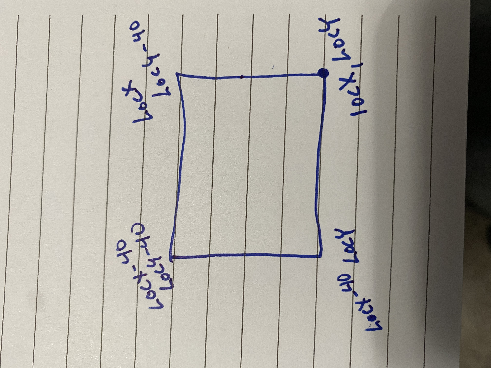

<!DOCTYPE html>
<html>

<head>
  <meta charset="utf-8">
  <meta name="viewport" content="width=device-width, initial-scale=1.0">
  
  <link rel="stylesheet" href="https://stackedit.io/style.css" />
</head>

<body class="stackedit">
  
<h2 id="dots-and-squares-game">Dots and Squares Game</h2>

Classic paper and pencil strategy game.

<h2 id="description">Description</h2>

Digital recreation of the classic game. 
Just use the mouse to select sides of the boxes. If your selection closes a box it will be filled in and you will get 1 point. 
The player with the most points wins.

<h2 id="list-of-features--user-stories">List of Features / User Stories</h2>
<ul>
<li>Game board should consist of a 5 x 5 grid of dots</li>
<li>User should be able to click where he/she wants a line drawn (which represents a side of a box)</li>
<li></li>
<li>User should not be able to click on an existing line and remove it</li>
<li>Game should fill in any closed boxes and increment the score</li>
<li>Game should make the score visible</li>
<li>Game should announce the winner</li>
<li>The winner is the player that has the most boxes filled in.</li>
</ul>
<h2 id="list-of-technologies-used">List of Technologies Used</h2>
<ul>
<li>HTML-5</li>
<li>CSS</li>
<li>Javascript</li>
</ul>
<h2 id="installation-instructions--getting-started">Installation Instructions / Getting Started</h2>

Follow the <a href="https://shaddecker.github.io/dots-and-squares-game/">link</a> to the web page and click “Start”

<blockquote>

Written with <a href="https://stackedit.io/">StackEdit</a>.

</blockquote>

</body>

</html>
